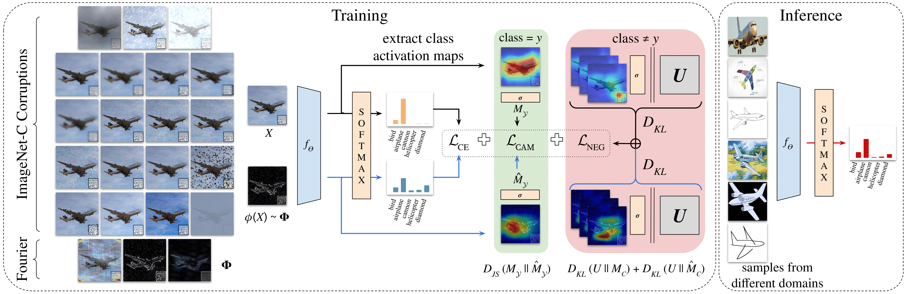

# ACVC
> [**Attention Consistency on Visual Corruptions for Single-Source Domain Generalization**](https://arxiv.org/abs/2204.13091)            
> [Ilke Cugu](https://cuguilke.github.io/), 
> [Massimiliano Mancini](https://www.eml-unitue.de/people/massimiliano-mancini), 
> [Yanbei Chen](https://www.eml-unitue.de/people/yanbei-chen), 
> [Zeynep Akata](https://www.eml-unitue.de/people/zeynep-akata)        
> *IEEE Computer Vision and Pattern Recognition Workshops (CVPRW), 2022* 

<p float="center">
  
</p>

The official PyTorch implementation of the **CVPR 2022, L3D-IVU Workshop** paper titled "Attention Consistency on Visual Corruptions for Single-Source Domain Generalization". This repository contains: (1) our single-source domain generalization benchmark that aims at generalizing from natural images to other domains such as paintings, cliparts and skethces, (2) our adaptation/version of well-known advanced data augmentation techniques in the literaure, and (3) our final model ACVC which fuses visual corruptions with an attention consistency loss.

## Dependencies
```
torch~=1.5.1+cu101
numpy~=1.19.5
torchvision~=0.6.1+cu101
Pillow~=8.3.1
matplotlib~=3.1.1
sklearn~=0.0
scikit-learn~=0.24.1
scipy~=1.6.1
imagecorruptions~=1.1.2
tqdm~=4.58.0
pycocotools~=2.0.0
```

- We also include a YAML script `acvc-pytorch.yml` that is prepared for an easy Anaconda environment setup. 

- One can also use the `requirements.txt` if one knows one's craft.

## Training

Training is done via `run.py`. To get the up-to-date list of commands:
```shell
python run.py --help
```

We include a sample script `run_experiments.sh` for a quick start.

## Analysis

The benchmark results are prepared by `analysis/GeneralizationExpProcessor.py`, which outputs LaTeX tables of the cumulative results in a .tex file.

- For example:
```shell
python GeneralizationExpProcessor.py --path generalization.json --to_dir ./results --image_format pdf
```

- You can also run distributed experiments, and merge the results later on:
```shell
python GeneralizationExpProcessor.py --merge_logs generalization_gpu0.json generalization_gpu1.json
```

## Case Study: COCO benchmark

COCO benchmark is especially useful for further studies on ACVC since it includes segmentation masks per image.

Here are the steps to make it work:
1. For this benchmark you only need 10 classes:
```
airplane
bicycle
bus
car
horse
knife
motorcycle
skateboard
train
truck
```


2. Download COCO 2017 [trainset](http://images.cocodataset.org/zips/train2017.zip), [valset](images.cocodataset.org/zips/val2017.zip), and [annotations](http://images.cocodataset.org/annotations/annotations_trainval2017.zip)


3. Extract the annotations zip file into a folder named `COCO` inside your choice of `data_dir` (For example: `datasets/COCO`)


4. Extract train and val set zip files into a subfolder named `downloads` (For example: `datasets/COCO/downloads`)


5. Download [DomainNet (clean version)](https://ai.bu.edu/M3SDA/)


6. Create a new `DomainNet` folder next to your `COCO` folder


7. Extract each domain's zip file under its respective subfolder (For example: `datasets/DomainNet/clipart`)


8. Back to the project, use `--first_run` argument once while running the training script:
```shell
python run.py --loss CrossEntropy --epochs 1 --corruption_mode None --data_dir datasets --first_run --train_dataset COCO --test_datasets DomainNet:Real --print_config
```


9. If everything works fine, you will see `train2017` and `val2017` folders under `COCO`


10. Both folders must contain 10 subfolders that belong to shared classes between COCO and DomainNet   


11. Now, try running ACVC as well:
```shell
python run.py --loss CrossEntropy AttentionConsistency --epochs 1 --corruption_mode acvc --data_dir datasets --train_dataset COCO --test_datasets DomainNet:Real --print_config
```


12. All good? Then, you are good to go with the COCO section of `run_experiments.sh` to run multiple experiments


13. That's it! 

## Citation

If you use these codes in your research, please cite:

```bibtex

```

## References

We indicate if a function or script is borrowed externally inside each file.
Specifically for visual corruption implementations we benefit from:

- The imagecorruptions library of [Autonomous Driving when Winter is Coming](https://github.com/bethgelab/imagecorruptions).

Consider citing this work as well if you use it in your project.
